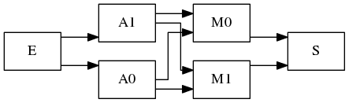
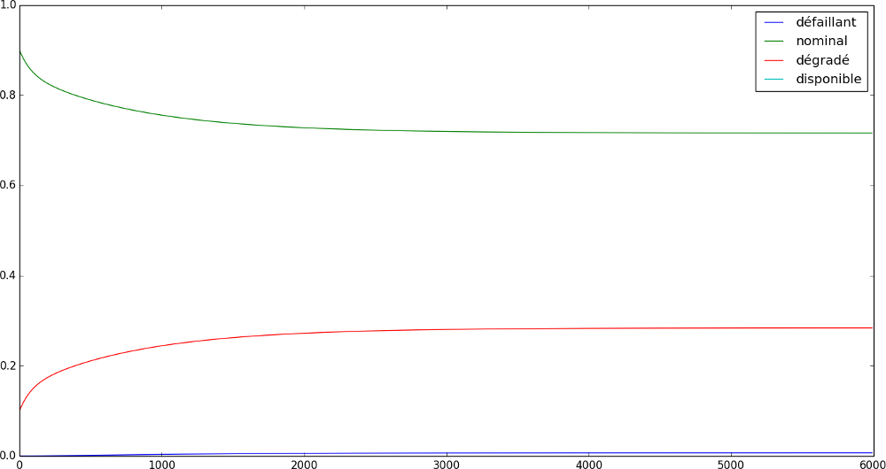

How to describe a system by a Markov process
============================================

fiabilipy enables the users to model a system trought a Markov process. This
tutorial aims to introduce how fiabilipy handles the Markov modelisation. This
introcduction is done using a example.

Let’s say we have a parallel-series system, represented by the following figure.

   A parallel-series system

We are interested by the probabilities for the system to be :

* in normal state (i.e. every component works)
* in damaged state (i.e. one or more component don’t work, but the system does
  work)
* in faulty state (i.e. the system doesn’t work at all)
* in available state (i.e. the system is not faulty)

Compoment and process initialisation
------------------------------------

To begin, let’s start building the components:

.. doctest::

    >>> from fiabilipy import Component, Markovprocess
    >>> A0, A1 = [Component('A{}'.format(i), 1e-4, 1.1e-3) for i in xrange(2)]
    >>> M0, M1 = [Component('M{}'.format(i), 1e-3, 1.2e-2) for i in xrange(2)]
    >>> components = (A0, A1, M0, M1)

To initialize the process, we need to give to fiabilipy the list of the
components and the initial states probabilities. A state is defined by a number
which, in base 2, says if the ith component is working or not. So, with 4
components, we have :math:`2^4 = 16` possible states. The following table
represents the possible stats (W stands for *working* and N for *not working*).

.. table:: states table

    =====  ==  ==  ==  ==
    state  A0  A1  M0  M1
    =====  ==  ==  ==  ==
    0      W   W   W   W
    1      W   W   W   N
    2      W   W   N   W
    3      W   W   N   N
    …      …   …   …   …
    15     N   N   N   N
    =====  ==  ==  ==  ==

Now, let’s assume that, at :math:`t = 0`, the probabilities of the system to be
in state 1 is 0.9 and state 2 is 0.1, thus we have:

.. doctest::

    >>> initstates = {0: 0.9, 1:0.1}
    >>> process = Markovprocess(components, initstates)

Working states definition
-------------------------

Now we have initialized our Markov process, we have to define the states to be
tracked. This is done a writing a function which return `True` if the given
state is tracked `False` otherwise. The functions will be called with one
argument, let’s say `x`. This variable is a boolean array, the ith case is
`True` if the ith component is currently working, `False` otherwise.

Ok, let’s define the states we want to track.

Normal state
~~~~~~~~~~~~

In this state, *every* component has to work. So, in python is can be written
as:

.. doctest::

    >>> def normal(x):
    ...     return all(x)

This function returns `True` if every single item of `x` is `True`.

Available state
~~~~~~~~~~~~~~~

In this state, the system is available. So, there exists a path of working
components for `E` to `S`. That is to say either A0 or A1
are working and M0 or M1 are. So, the function describing the faulty state may be:

.. doctest::

    >>> def available(x):
    ...     return (x[0] or x[1]) and (x[2] or x[3])

Damaged state
~~~~~~~~~~~~~

Actually, when you have described what the available state is, you have made the
harder part. Because, the other states can be described as combinations of it.
For instance, the system is damaged when the system is in available state *and
not* in the normal state. Therefore:

.. doctest::

    >>> def damaged(x):
    ...     return available(x) and not(normal(x))

Faulty state
~~~~~~~~~~~~

The system is faulty when not available. So, it’s quite simply to describe:

.. doctest::

    >>> def faulty(x):
    ...     return not available(x)

Compute the probabilities
-------------------------

Now you have written the functions describing the states, it is really simple to
ask fiabilipy the probabilities you want. For instance, to know the probability
of the system being available at :math:`t = 150h`, simply write:

.. doctest::

    >>> process.value(150, available)
    0.97430814090407503

At :math:`t = 1000h`, the probability that every component is still working is:

.. doctest::

    >>> process.value(1000, normal)
    0.30900340684254302

Drawing plots
~~~~~~~~~~~~~

Now you are able to compute the probabilities you want, for the states you want,
for the time you want, let’s plot those probabilities. The following code gives
you a example of how to plot the variation of the probabilities.

.. doctest::

    >>> import pylab as p
    >>> states = {u'normal': normal,
    ...           u'available': available,
    ...           u'damaged': damaged,
    ...           u'faulty': faulty,
    ...          }
    >>> timerange = range(0, 6000, 10)
    >>> for (name, func) in states.iteritems():
    ...     proba = [process.value(t, func) for t in timerange]
    ...     p.plot(timerange, proba, label=name)
    >>> p.legend()
    >>> p.show()

And, this code gives you the following figure:

