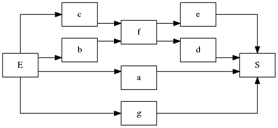
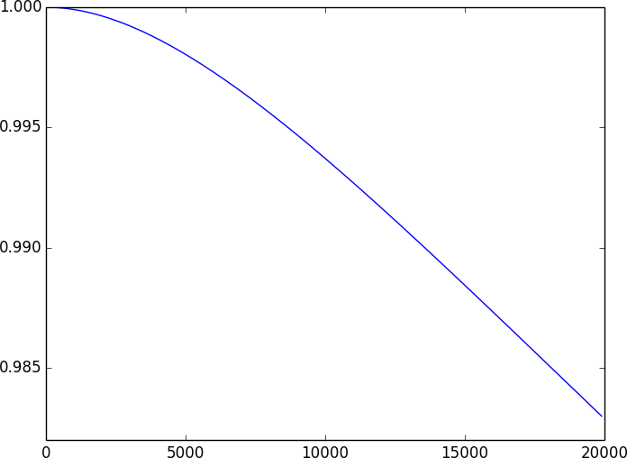

How to build a system
=====================

A system is built by putting components together. So, let’s have a look on how
to build components.

Building components
-------------------

A component is defined as an instance of the
:class:`~fiabilipy.system.Component` class having a *constant* reliability rate,
let’s say :math:`\lambda = 10^{-4}h^{-1}`.

.. doctest::

    >>> from fiabilipy import Component
    >>> from sympy import Symbol
    >>> t = Symbol('t', positive=True)
    >>> comp = Component('C0', 1e-4)

You have successfully created your first component. `C0` is the name of the
component ; naming your components will be useful to draw diagrams later.

You can access to some useful information about your component, such as the
:abbr:`MTTF (Mean-Time-To-Failure)`, the reliability etc.

.. doctest::

    >>> comp.mttf
    10000.0
    >>> comp.reliability(1000)
    0.904837418035960
    >>> comp.reliability(t)
    exp(-0.0001*t)
    >>> comp.reliability(t=100)
    0.990049833749168

Gather components to build a system
-----------------------------------

Now you can build components, let’s gather them to build a system. A system is
described as a graph of components. There are two special components used to
materialize the entry and the exit of the system : `E` and `S`. They are
compulsory, don’t forget them.

For instance, you could create a simple series system of two components as
follow:

.. doctest::

    >>> from fiabilipy import System
    >>> power = Component('P0', 1e-6)
    >>> motor = Component('M0', 1e-3)
    >>> S = System()
    >>> S['E'] = [power]
    >>> S[power] = [motor]
    >>> S[motor] = 'S'

Once your system is created, you can access to the data you want, such and
:abbr:`MTTF (Mean-Time-To-Failure)`, reliability, etc.

.. doctest::

    >>> S.mttf
    1000000/1001 
    >>> float(S.mttf)
    999.000999000999
    >>> S.reliability(t)
    exp(-1001*t/1000000)

An example of complex system
~~~~~~~~~~~~~~~~~~~~~~~~~~~~

Let’s build the following system :

   A example of _complex_ system

.. doctest::

    >>> a, b, c, d, e, f, g = [Component('C%i' % i, 1e-4) for i in xrange(7)]
    >>> S = System()
    >>> S['E'] = [a, b, c, g]
    >>> S[a] = S[g] = S[e] = S[d] = 'S'
    >>> S[b] = S[c] = [f]
    >>> S[f] = [e, d]

And, you can easily access to the data you want, as previously.

.. doctest::

    >>> S.mttf
    331000/21
    >>> S.reliability(t)
    13*exp(-t/2000) - 12*exp(-t/2500) - exp(-t/5000) - 6*exp(-3*t/5000) + 2*exp(-t/10000) + 4*exp(-3*t/10000) + exp(-7*t/10000)

As you may see, even if the system is complex, it is quite easy to describe it
with fiabilipy.

Draw graphics
-------------

Now you know how to build system with ease, let’s draw some graphics. For
instance, reliability versus time.

The first thing to do, is to import the :py:mod:`pylab` module, which provides a
lot of function to do mathematical stuff *and* to draw graphics:

.. doctest::

    >>> import pylab as p

Now, let’s define a simple parallel system with two components.

.. doctest::

    >>> a, b = Component('a', 1e-4), Component('b', 1e-6)
    >>> S = System()
    >>> S['E'] = [a, b]
    >>> S[a] = S[b] = 'S'

In order draw the graphic, we need a time range of study, for instance, from
:math:`t = 0` to :math:`t = 200`, by steps of :math:`10` (the unit of time is the
one you choose). Once the time range is defined, we compute the reliability of
each time step:

.. doctest::

    >>> timerange = range(0, 20000, 100)
    >>> reliability = [S.reliability(t) for t in timerange]

To finish, you only have to plot:

.. doctest::

    >>> p.plot(timerange, reliability) # doctest: +SKIP
    >>> p.show()

You can admire the result.

   The reliability graphic
